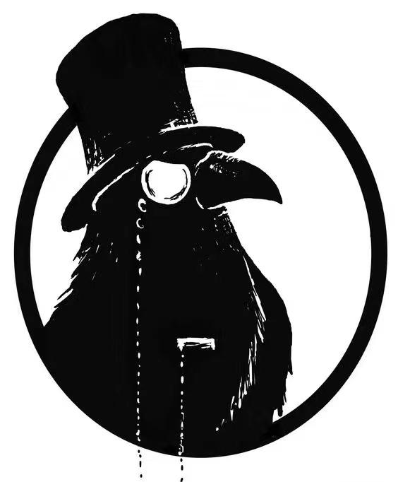

<h1 align="center">
  <p style="display:flex;align-item:center;">RWKV-PEFT</p>
</h1>

\[ English | [中文](README_zh.md) \]
### Installation

> [!IMPORTANT]
> Installation is mandatory.

```bash
git clone https://github.com/JL-er/RWKV-PEFT.git
cd RWKV-PEFT
pip install -r requirements.txt
```

# Release
- infctx
- fla --fla
- State tuning
- Quant(QPissa,QLora) --quant int8/nf4
- Bone
- Pissa
- Lisa
- Lora
- dataload(get、pad、only)
### High performance on consumer hardware

Consider the memory requirements for training the following models with an 4090 24GB GPU with 64GB of CPU RAM.(--strategy deepspeed_stage_1 --ctx_len 1024 --micro_bsz 1 --lora_r 64)

|   Model         | Full Finetuning | lora/pissa  | Qlora/Qpissa | State tuning |
| --------- | ---- | ---- | ---- | ---- |
| RWKV6-1.6B | OOM GPU | 7.4GB GPU | 5.6GB GPU | 6.4GB GPU |
| RWKV6-3B | OOM GPU | 12.1GB GPU | 8.2GB GPU | 9.4GB GPU |
| RWKV6-7B | OOM GPU | 23.7GB GPU(bsz 8 OOM) | 14.9GB GPU(bsz 8 need 19.5GB) | 18.1GB GPU |
#### Quant State Tuning
- strategy deepspeed_stage_1
- ctx_len 1024
- micro_bsz 1
- 4090 24G

|   Model         | bf16 | int8  | nf4/fp4/4bit |
| --------- | ---- | ---- | ---- |
| RWKV6-1.6B | 6.1GB GPU | 4.7GB GPU | 4.1GB GPU |
| RWKV6-3B | 9.1GB GPU | 6.5GB GPU | 5.2GB GPU |
| RWKV6-7B | 17.8GB GPU | 11.9GB GPU | 8.5GB GPU |
| RWKV6-14B | xxGB GPU | xxGB GPU | xxGB GPU |
# Quick Start
According to Necessary Dependencies
```
pip install -r requirements.txt
```
Refer to the examples in the scripts folder to modify the paths and required parameters (for detailed data preparation, please refer to the official RWKV tutorial).
```
sh scripts/run_lora.sh
```
# Parameter Description
- peft  
The parameter 'peft' contains multiple methods. Refer to the detailed description, choose the required method, and then configure the corresponding 'config'.
```
--peft bone --bone_config $bone_config
```
- train_parts  
More freedom in choosing which parts to train, such as "emb", "head", "time", "ln". If you want to train only the k and v parts, you can simply set [].
For regular fine-tuning users, it's not recommended to add this parameter. If not added, ["time", "ln"] will be included by default. These parts account for a small proportion of the total parameters.
```
--train_parts ["time", "ln"]
```
- Quant  
When using PEFT or state tuning, you can use Quantized weights to reduce memory usage.
```
--quant int8/nf4
```
- infctx  
RWKV series has a unique training method (infinite length training) that can be used with any fine-tuning method to prevent memory explosion caused by excessively long training data.
ctx_len is the length you want to train (set according to the length of the training data).
chunk_ctx should be adjusted appropriately based on memory, and chunk_ctx is obtained by slicing from ctx_len, so ensure that chunk_ctx is smaller than ctx_len.
Add script parameters as follows:
```
--train_type infctx --chunk_ctx 512 --ctx_len 2048
```
- State tuning  
RWKV's unique fine-tuning method has very low training overhead.
```
--train_type "state" --fla
```
- dataload  
Supports different data sampling methods. By default, it uses get(RWKV-LM), which is a random sampling method that treats all data as a single sequence and randomly slices it according to ctx_len for easier parallel processing.
pad and only are used to sample from the beginning of each piece of data.
pad: Pads at the end. For example, if ctx_len is 1024 and the actual length of the current sampled data is 1000, it will pad with the first 24 tokens of the next piece of data at the end for easier parallel processing.
only: Only supports cases where bsz=1. It sets ctx_len to be equal to the maximum sampling length. If the current sampled data length exceeds ctx_len, any excess part will be truncated.
```
--dataload pad
```
- loss_mask  
Supports masking the question part in QA tasks as well as the padding at the end to prevent the model from memorizing answers based on questions, thereby enhancing the model's generalization ability.
```
--loss_mask qa/pad
```
- strategy  
DeepSpeed memory allocation strategies:
Prefer using strategy 1.
When the model is large or during full fine-tuning, use strategy 2 or 3.
If memory still overflows, use offload.
Strategy 3 allows for model parallelism (a single model is split across multiple GPUs).
deepspeed_stage_1
deepspeed_stage_2
deepspeed_stage_2_offload
deepspeed_stage_3
deepspeed_stage_3_offload
```
deepspeed_stage_1
```
- ctx_len  
Sample training length and adjust according to data length. As ctx_len increases, memory usage will also increase.
- micro_bsz  

# Citation
If you find this repo useful, please consider citing our works:
```bib
@misc{kang2024boneblockaffinetransformation,
      title={Bone: Block Affine Transformation as Parameter Efficient Fine-tuning Methods for Large Language Models}, 
      author={Jiale Kang},
      year={2024},
      eprint={2409.15371},
      archivePrefix={arXiv},
      primaryClass={cs.CL},
      url={https://arxiv.org/abs/2409.15371}, 
}
